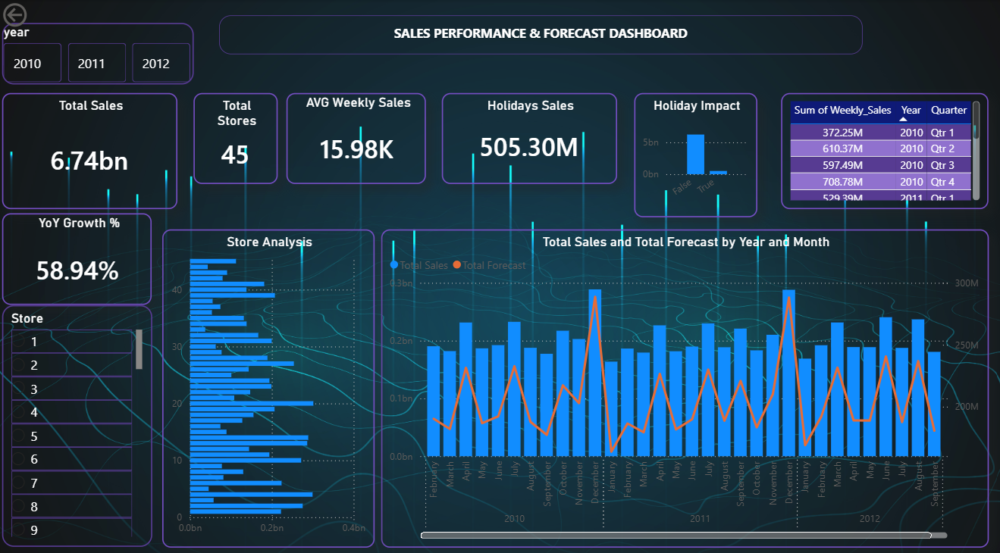

# Sales_forecasting
Analyzed retail sales data using Python and Pandas to identify seasonal patterns, growth trends, and sales performance. Implemented moving average forecasting and built an interactive Power BI dashboard to compare actual vs forecasted sales using trend charts and KPI visuals.

## Dashboard Preview

# Sales Forecasting & Analysis Dashboard

This project focuses on analyzing retail sales data and forecasting future sales trends using Python, Pandas, and Power BI. The goal of the project is to identify seasonal patterns, understand sales performance over time, and create a dashboard that compares actual sales with forecasted sales.

The dataset was cleaned and analyzed using Python, followed by time-series analysis to observe monthly sales trends, growth patterns, and fluctuations in revenue. A moving average forecasting technique was implemented to estimate future sales performance and provide a simple, understandable forecasting approach.

An interactive Power BI dashboard was created to visualize key sales metrics, actual vs forecasted sales, trend charts, and KPI visuals. The dashboard helps users monitor sales performance, identify seasonal demand patterns, and support better business planning.

## Key Features

- Cleaned and analyzed retail sales data using Python and Pandas
- Performed time-series analysis to identify sales trends and seasonality
- Implemented moving average forecasting to estimate future sales
- Compared actual sales values with forecasted sales values
- Built an interactive Power BI dashboard with KPI visuals and trend charts
- Identified seasonal patterns, growth trends, and sales performance insights

## Tools Used

- Python
- Pandas
- Power BI
- Moving Average Forecasting
- Excel

## Business Impact

This dashboard helps businesses understand sales performance over time and estimate future sales trends. It can support better inventory planning, demand forecasting, revenue tracking, and data-driven decision-making.
